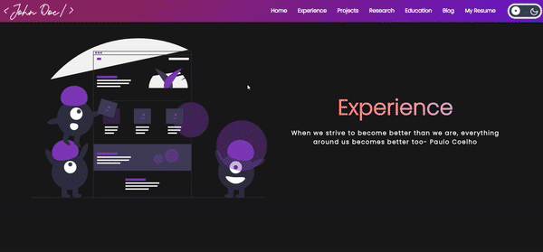

Taken from the community maintained open source project aimed at making personal portfolio for researchers, developers and analysts simple, fast and less cumbersome. Credit to **smaranjitghose** with the 

## A sneak peek into what we have here🙈 :

### Home Page:

### Experience Page:

### Project Page:

### Research Page:

### Education Page:

